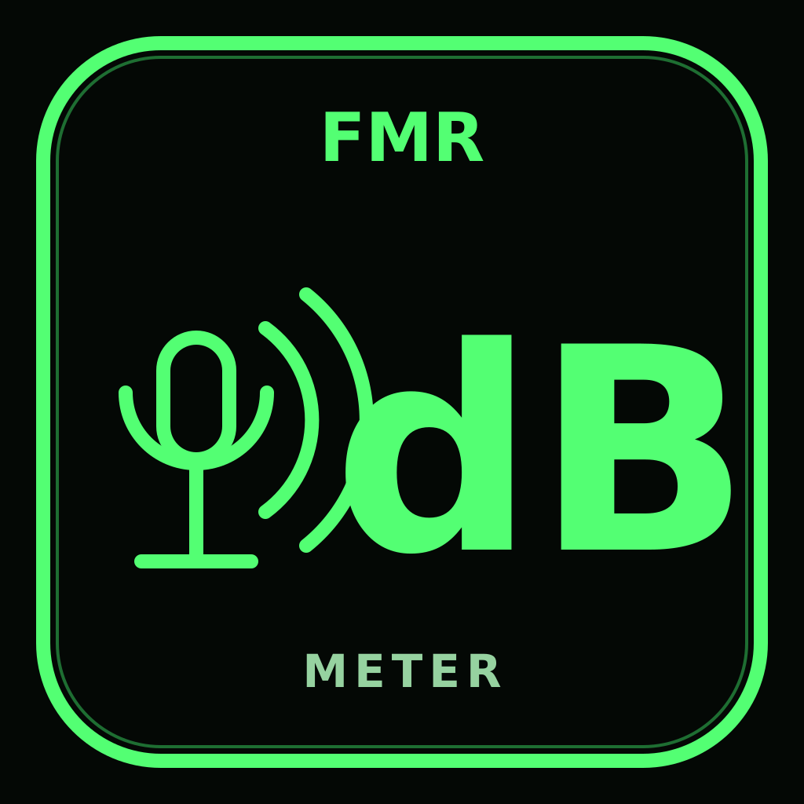

  

# FMR dB Meter

A small, offline native Android sound-level meter.

## Features

- Current estimated dBA
- 10-second Leq
- Peak level
- A-weighted dBFS
- User-adjustable calibration offset
- Native Android microphone permission prompt

## Privacy

- Only runtime permission: `RECORD_AUDIO`
- No `INTERNET` permission
- No ads, analytics, accounts, uploads, or audio-file recording
- Audio is processed in memory only

## Accuracy

Phone microphones are not calibrated SPL instruments. The absolute dBA value depends on the phone microphone and should be calibrated against a trusted sound meter when accuracy matters. Relative comparisons made with the same phone and placement are generally much more useful.

## Build

Android app written in Java. Requires JDK 17 and Android SDK 35.
